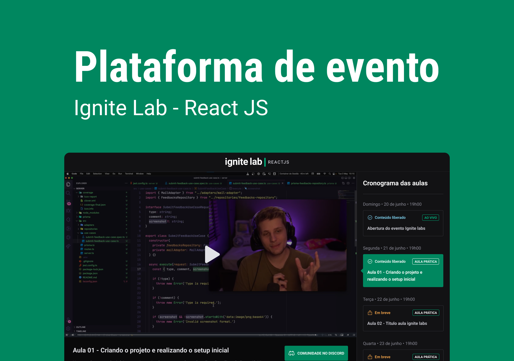

<p align="center">
  
</p>

<h1 align="center">
  
</h1>

<br />

## 💻 Projeto

A Plataforma de Eventos é um projeto que visa facilitar a organização e participação em eventos de forma eficiente e interativa. A plataforma oferece recursos para o planejamento, gerenciamento e divulgação de eventos, permitindo que organizadores e participantes tenham uma experiência fluida e enriquecedora.

## 🧪 Tecnologias

Esse projeto foi desenvolvido com as seguintes tecnologias

- [ReactJS](https://reactjs.org)
- [Vite](https://vitejs.dev)
- [TailwindCSS](https://tailwindcss.com/)
- [GraphCMS](https://graphcms.com/)
- [GraphQL](https://graphql.org/)
- [TypeScript](https://www.typescriptlang.org/)

## 🚀 Como executar

Antes de começar a executar esse projeto é necessário ter o [Node.js](https://nodejs.org/) e o [Git](https://git-scm.com) instalado na sua máquina

Primeiro você deve clonar 

```bash
$ git clone https://github.com/FernandaZaccaroRigolin/EventIgniteLabReact
```

A seguir, siga os passos abaixo:

```bash
# Instale as dependências rodando este comando:
$ yarn or npm install
# Inicie o projeto rodando este comando:
$ yarn dev or npm run dev
```

O app estará disponível no seu navegando acessando o endereço http://localhost:3000.
